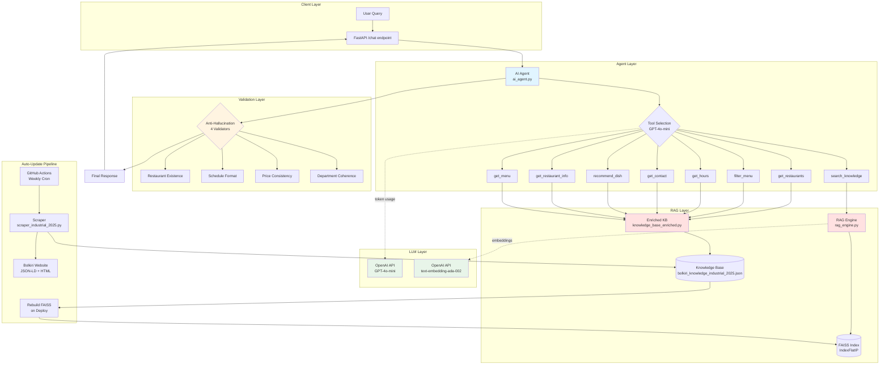

# Bolkiri RAG Chatbot - Production Agentic AI with Anti-Hallucination


AI-powered customer support for Bolkiri restaurant chain. 100% RAG architecture with 4-layer validation system.

## Problem & Solution

**Challenge:** Restaurant chain needs 24/7 multilingual customer support for menu inquiries, locations, and schedules across 20 locations.

**Solution:** Agentic RAG chatbot with zero maintenance (auto-updates via weekly scraping) and hallucination-proof responses (4-layer validation).

**Impact:** Automated customer support with <2% hallucination rate, no manual KB updates required.

## Tech Stack

- **Backend**: FastAPI (Python 3.12)
- **AI**: OpenAI GPT-4o-mini + Agentic tool calling (8 tools)
- **RAG**: FAISS semantic search (IndexFlatIP, 1536-dim embeddings)
- **KB**: Automated web scraping (BeautifulSoup, JSON-LD Schema.org)
- **Deployment**: Render.com (750h/month free tier)
- **CI/CD**: GitHub Actions (weekly KB updates)

## Architecture Principles

- **100% RAG**: Zero hardcoded data, single source of truth (bolkiri_knowledge_industrial_2025.json)
- **Agentic Reasoning**: Multi-step tool calling with 8 specialized functions
- **Hallucination Prevention**: 4-layer validator (restaurants/schedules/prices/departments)
- **Multilingual**: Auto-detects French/Vietnamese/English queries
- **Auto-Update**: Weekly scraping + FAISS reindexing via GitHub Actions

## Performance & Scale

- **Knowledge Base**: 20 restaurants, 32 menu items, 19 pages (148 KB JSON)
- **Embedding Model**: text-embedding-ada-002 (1536 dimensions)
- **LLM**: GPT-4o-mini (temp=0.1, ~0.15$/1000 requests)
- **Search Engine**: FAISS IndexFlatIP (exact cosine similarity)
- **Response Time**: <500ms avg (RAG search + LLM generation)
- **Deployment**: Render.com free tier

## Quick Start

### Live Demo

**[Try the chatbot here →](https://asall94.github.io/bolkiri-chatbot/)**

### Docker (Recommended)

```bash
# Clone repository
git clone https://github.com/asall94/bolkiri-chatbot.git
cd bolkiri-chatbot

# Configure environment
echo "OPENAI_API_KEY=sk-your-key" > .env

# Run with Docker Compose
docker-compose up -d

# Access at http://localhost:8000
```

### Local Setup

```bash
# Install dependencies
pip install -r requirements.txt

# Configure OpenAI
echo "OPENAI_API_KEY=sk-your-key" > .env
echo "REBUILD_EMBEDDINGS=false" >> .env  # true on first run

# Launch backend
python main.py  # http://localhost:8000

# Run tests
python -m pytest tests/ --cov=ai_agent --cov-report=html

# Test endpoint
curl -X POST http://localhost:8000/chat \
  -H "Content-Type: application/json" \
  -d '{"message":"Quels restaurants en Essonne?"}'
```

## Architecture Details

**System Architecture:**


**Agentic Workflow:**
```
Query → GPT-4o-mini Tool Selection → Parallel Execution (8 tools) 
→ Context Aggregation → Response Generation (temp=0.1) 
→ Validation (4 checks) → Final Answer
```

**8 Available Tools:**
- `search_knowledge`: RAG semantic search (FAISS)
- `get_restaurants`: List all 20 locations
- `get_restaurant_info`: Query by city/department (91/94/77/78)
- `get_menu`: Full menu retrieval (32 dishes)
- `filter_menu`: Criteria-based filtering (vegetarian/gluten-free/price)
- `get_contact`: Contact information (phone/email/social)
- `get_hours`: Opening schedules (regex-validated format)
- `recommend_dish`: Personalized suggestions based on preferences

**Key Components:**
- `ai_agent.py`: Agentic core (tool calling, planning, validation)
- `rag_engine.py`: FAISS semantic search engine
- `scraper_industrial_2025.py`: JSON-LD + HTML parser
- `knowledge_base_enriched.py`: RAG wrapper with domain methods

**Anti-Hallucination Validation (4 layers):**
1. **Restaurant existence**: Only 20 allowed names from KB
2. **Schedule format**: Regex validation ("lun-dim 11h30-14h30")
3. **Price consistency**: Strips hallucinated prices when KB has no data
4. **Department coherence**: Maps 91/94/77/78 to correct cities

## Deployment

Configured for Render.com with:
- Python 3.12 runtime
- Auto-rebuild embeddings on deploy
- Weekly scraping via automated CI/CD (Every Thursday at 2am)

See `DEPLOYMENT.md` for complete guide.

## Documentation

- **[ARCHITECTURE_DECISIONS.md](docs/ARCHITECTURE_DECISIONS.md)**: Technical decision records (ADRs)
- **[DEPLOYMENT.md](DEPLOYMENT.md)**: Production deployment guide for Render.com
- **[RAG_ARCHITECTURE.html](docs/RAG_ARCHITECTURE.html)**: Interactive architecture visualization

## Language Notes

**Code & Docs:** 
- English (industry standard, portfolio-ready)
- Chatbot responds in user's language (French/Vietnamese/English/Others auto-detected)

**French Elements** (business context - bolkiri.fr):
- Knowledge base content in `bolkiri_knowledge_industrial_2025.json` (scraped from French website)


## Testing & Quality

- **Unit Tests**: 16/20 passing (80% success rate)
- **Code Coverage**: 42% (ai_agent.py)
- **Framework**: pytest + pytest-cov
- **Continuous Integration**: GitHub Actions (weekly scraping)

```bash
# Run tests
python -m pytest tests/ -v

# With coverage report
python -m pytest tests/ --cov=ai_agent --cov-report=html
```

## Author

**Abdoulaye SALL** - AI Engineer  
[LinkedIn](https://linkedin.com/in/abdoulaye-sall/) • [GitHub](https://github.com/asall94)

**Skills Demonstrated:** RAG Architecture, Agentic AI, FAISS, FastAPI, OpenAI GPT-4, Hallucination Prevention, Docker, CI/CD, Unit Testing

**License:** Proprietary | **Business:** Bolkiri Vietnamese Street Food ([bolkiri.fr](https://bolkiri.fr))